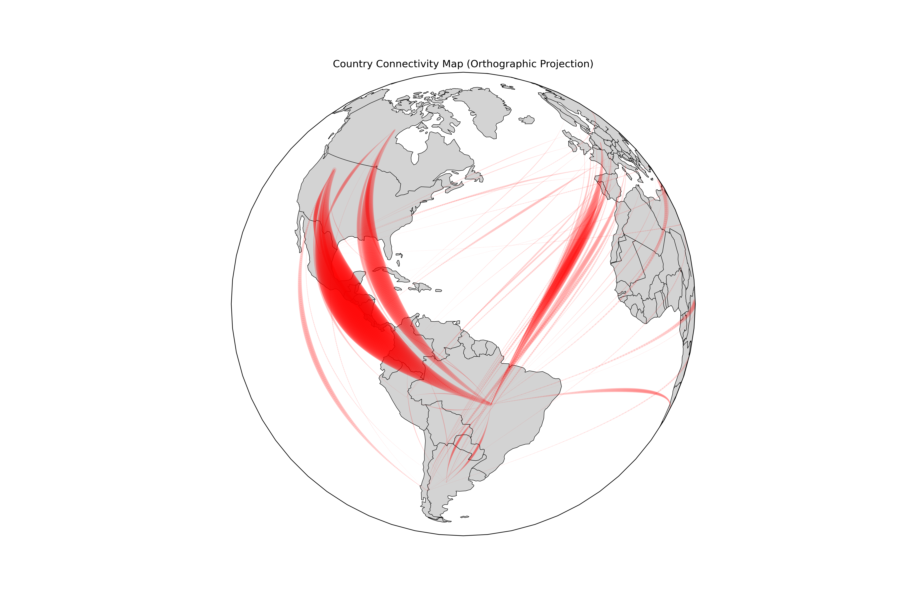
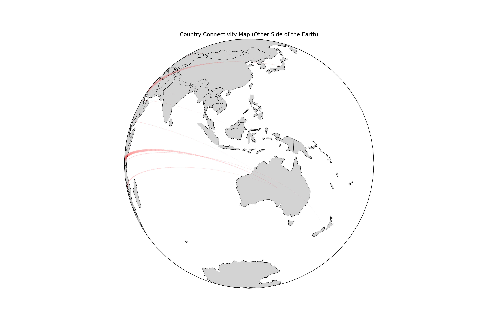

# fNIRSlatAm
Code to create an fNIRS publication network in Latin American countries

## Installation instructions
Install MiniConda: Download and install MiniConda from the [official site](https://docs.conda.io/en/latest/miniconda.html)

```
# Create & activate a new conda environment
conda create -n map_env python=3.9
conda activate map_env
```

```
# Install core Python libraries
conda install -c conda-forge pandas geopandas matplotlib shapely cartopy
```

```
# Install Excel‐writing support
conda install -c conda-forge xlsxwriter
```

```
# Install country‑lookup package
conda install -c conda-forge pycountry
```

## Running the code
```
python master_script.py
python latam_map.py
```

## Output


